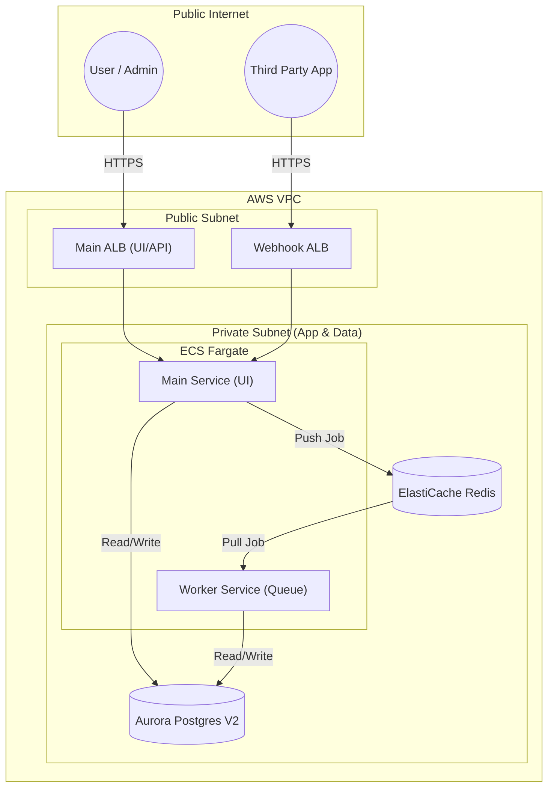

Deploying n8n for personal automation is often as simple as running a Docker container on a VPS. However, when deploying n8n for enterprise use—where reliability, security, and scalability are non-negotiable—a robust cloud architecture is required. The official doc suggests to use EKS with K8s but if you are looking for a more cost-effective solution, you can use ECS Fargate. (plus you also want to avoid the complexity of managing a Kubernetes cluster)

In this article, we will explore how to deploy n8n on AWS using the **AWS Cloud Development Kit (CDK)**. We will replicate a proven architecture that utilizes **ECS Fargate**, **Aurora Serverless**, and a unique **Dual Load Balancer** strategy to separate administrative traffic from high-volume webhook events.

## The Goal
By the end of this guide, you will understand how to deploy an n8n service that:
1.  **Scales horizontally** using a worker-queue architecture.
2.  **Isolates traffic** by separating the UI from webhook ingestion.
3.  **Manages state** using Serverless PostgreSQL and Redis.
4.  **Automates deployment** via a CI/CD pipeline with multi-environment support (QA/Prod).
 
---

## 1. The Architecture: Queue Mode on Fargate

To achieve high availability, we cannot run n8n as a monolithic instance. Instead, we use **Queue Mode**. This decouples the "Producer" (the main n8n instance handling webhooks and the UI) from the "Consumer" (Workers that execute the workflows).

### The Compute Layer

Here is a high-level view of how the traffic and data flow through the system:



We utilize **AWS ECS Fargate** to run containerized tasks without managing servers.
*   **Main Service:** Handles the Web UI, API, and incoming Webhooks.
*   **Worker Service:** Dedicated solely to executing workflows.

In our configuration, we explicitly set the `EXECUTIONS_MODE` environment variable to `queue`. This ensures that when a workflow is triggered, the job is sent to Redis rather than being executed immediately on the web server, allowing the web server to remain responsive during heavy loads.

### The Data Layer
State management is handled by two core components defined in our `DataStack`:
1.  **Database:** We use **Aurora PostgreSQL Serverless v2**. This stores workflow definitions, execution history, and user data. It scales capacity units automatically based on demand.
    ```
    engine: DatabaseClusterEngine.auroraPostgres({
    version: AuroraPostgresEngineVersion.VER_15_4,
    }),
    ```

2.  **Cache/Queue:** We use **Amazon ElastiCache for Redis**. This acts as the message broker between the Main service and the Workers.
    > **Note:** Use Valkey if you need to cost effective solution rather than Redis.

---

## 2. The Networking Strategy: The Dual ALB Pattern

One of the most distinct features of this architecture is the use of **two separate Application Load Balancers (ALBs)**. While both ALBs target the same ECS Service, they serve different purposes and domains:

1.  **Main ALB (`n8n.your-domain.com`):** Serves the n8n Editor UI and authenticated API traffic. This is typically restricted by stricter security groups (e.g., VPN or Office IPs).
2.  **Webhook ALB (`n8n-webhook.your-domain.com`):** Dedicated to receiving webhook triggers from external third-party services. This must be publicly accessible.

    ### example

    - main and webhook alb are in the same vpc.

      ```typescript
      const mainAlb = new ApplicationLoadBalancer(this, 'MainAlb', {
          vpc: this.vpc,
          internetFacing: true,
          securityGroups: [this.mainAlbSecurityGroup],
      });

      const webhookAlb = new ApplicationLoadBalancer(this, 'WebhookAlb', {
          vpc: this.vpc,
          internetFacing: true,
          securityGroups: [this.webhookAlbSecurityGroup],
      });
      ```

    - Listeners & Certificates

      > We are using a **Deny by Default** strategy here. 
      > 
      > You start with a listener that returns 404 for everything.
      > This ensures that only traffic you explicitly configured (e.g., matching n8n.your-domain.com) is forwarded to your containers, while random IP scanners or mismatched requests simply get a generic 404 from the load balancer itself, saving your application resources!

      ```typescript
        // HTTPS Listeners
        const mainHttpsListener = this.mainBalancer.addListener('MainHttps', {
          port: 443,
          open: true,
          certificates: [certificate], // Certificate from ACM
          defaultAction: ListenerAction.fixedResponse(404, {
            contentType: 'text/plain',
            messageBody: 'No routes matched',
          }),
        });

        const webhookHttpsListener = this.webhookBalancer.addListener('WebhookHttps', {
          port: 443,
          open: true,
          certificates: [certificate],
          defaultAction: ListenerAction.fixedResponse(404, {
            contentType: 'text/plain',
            messageBody: 'No routes matched',
          }),
        });

        /*
        Later in your code (typically in the standard ECS Service definition), you call .addTargets() to explicitly attach your ECS Service to this listener.
        */
      ```

### Why do this?
*   **Security Isolation:** You can lock down your Admin UI to internal IP ranges while keeping webhook endpoints open to the world.
*   **Traffic Isolation:** Webhook traffic is often bursty. Separating them prevents a flood of webhook events from degrading the performance of the Admin UI.
*   **Fail-Safe Operation:** If the Admin UI is undergoing maintenance, webhook ingestion can theoretically continue uninterrupted.

### Solving the CORS Challenge
Because the UI and Webhooks live on different domains (e.g., `n8n.yopa.cloud` vs `n8n-webhook.yopa.cloud`), the n8n Editor needs to make Cross-Origin Resource Sharing (CORS) requests to test webhooks.

To support this, we configure the ALBs to inject specific CORS headers. We use a custom resource to modify listener attributes, adding headers like `Access-Control-Allow-Origin` and `Access-Control-Allow-Credentials: true`. This allows the UI domain to successfully communicate with the Webhook domain during workflow testing.

---

## 3. Infrastructure as Code: The CDK Stack

We organize our infrastructure into three primary stacks to manage dependencies and lifecycle:

### A. Shared Stack
This stack handles the VPC lookup and foundational security groups. It ensures that our compute resources are placed in private subnets with egress access, while the load balancers sit in public subnets.

### B. Data Stack
This initializes the Aurora Cluster and Redis Cluster. Crucially, it manages **AWS Secrets Manager** entries for the database credentials (`DB_POSTGRESDB_USER`, `DB_POSTGRESDB_PASSWORD`) and the n8n encryption key (`N8N_ENCRYPTION_KEY`). This ensures sensitive keys are never hardcoded in the application configuration.

``` typescript
// src/stacks/data-stack.ts

// Database credentials
this.dbSecret = new Secret(this, 'PostgresSecret', {
  secretName: this.namingUtility.getFullName('postgres-credentials'),
  generateSecretString: {
    secretStringTemplate: JSON.stringify({ username: 'n8n' }),
    generateStringKey: 'password',
    excludePunctuation: true,
  },
  removalPolicy: this.props.removalPolicy,
});

// n8n Encryption Key (Critical for decrypting workflow credentials)
this.n8nEncryptionKey = new Secret(this, 'N8nEncryptionKey', {
  secretName: this.namingUtility.getFullName('n8n-encryption-key'),
  generateSecretString: {
    excludePunctuation: false,
    includeSpace: false,
    passwordLength: 32,
  },
  removalPolicy: this.props.removalPolicy,
});
```

### C. Compute Stack
This stack defines the ECS Cluster, Task Definitions, and Services. It injects the necessary environment variables into the container environment:

```typescript
// src/stacks/compute-stack.ts

import { FargateService, FargateTaskDefinition, ContainerImage, EcsSecret, SubnetType } from 'aws-cdk-lib/aws-ecs';
import { ApplicationProtocol } from 'aws-cdk-lib/aws-elasticloadbalancingv2';
import { Duration } from 'aws-cdk-lib';

// ---------------------------------------------------------
// Shared Configuration
// ---------------------------------------------------------

const commonEnvironment = {
  // Database Configuration
  DB_TYPE: 'postgresdb',
  DB_POSTGRESDB_HOST: dbCluster.clusterEndpoint.hostname,
  DB_POSTGRESDB_PORT: dbCluster.clusterEndpoint.port.toString(),
  DB_POSTGRESDB_DATABASE: 'n8n',

  // Queue Configuration
  EXECUTIONS_MODE: 'queue',
  QUEUE_BULL_REDIS_HOST: redisCluster.attrRedisEndpointAddress,
  QUEUE_BULL_REDIS_PORT: redisCluster.attrRedisEndpointPort,

  // Security Hardening
  NODES_EXCLUDE: '["n8n-nodes-base.executeCommand", "n8n-nodes-base.readWriteFile"]',
  NODE_FUNCTION_ALLOW_BUILTIN: 'path,crypto,url,util,http,https,querystring',
  
  // Webhook & UI URLs
  N8N_EDITOR_BASE_URL: `https://${mainDomain}/`,
  WEBHOOK_URL: `https://${webhookDomain}/`,
};

const commonSecrets = {
  DB_POSTGRESDB_USER: EcsSecret.fromSecretsManager(dbSecret, 'username'),
  DB_POSTGRESDB_PASSWORD: EcsSecret.fromSecretsManager(dbSecret, 'password'),
  N8N_ENCRYPTION_KEY: EcsSecret.fromSecretsManager(n8nEncryptionKey),
};

// ---------------------------------------------------------
// 1. Main Service (UI & Webhooks)
// ---------------------------------------------------------

const mainTaskDefinition = new FargateTaskDefinition(this, 'MainTaskDefinition', {
  memoryLimitMiB: 2048, cpu: 1024, executionRole, taskRole,
});

mainTaskDefinition.addContainer('n8n-main', {
  // Use the latest n8n image but I recommend to use a specific version in the production environment
  image: ContainerImage.fromRegistry('n8nio/n8n:latest'),
  essential: true,
  environment: commonEnvironment,
  secrets: commonSecrets,
});

const mainService = new FargateService(this, 'MainService', {
  cluster,
  taskDefinition: mainTaskDefinition,
  desiredCount: 1, // High Availability typically handled here
  vpcSubnets: { subnetType: SubnetType.PRIVATE_WITH_EGRESS },
  securityGroups: [DEFINED_SECURITY_GROUPS],
  assignPublicIp: false,
});

// Register Main Service to ALBs
mainHttpsListener.addTargets('MainTarget', {
  port: 5678, protocol: ApplicationProtocol.HTTP, targets: [mainService],
  healthCheck: { path: '/healthz', interval: Duration.seconds(30) },
});

webhookHttpsListener.addTargets('WebhookTarget', {
  port: 5678, protocol: ApplicationProtocol.HTTP, targets: [mainService],
  healthCheck: { path: '/healthz', interval: Duration.seconds(30) },
});

// ---------------------------------------------------------
// 2. Worker Service (Workflow Execution)
// ---------------------------------------------------------

const workerTaskDefinition = new FargateTaskDefinition(this, 'WorkerTaskDefinition', {
  memoryLimitMiB: 2048, cpu: 1024, executionRole, taskRole,
});

workerTaskDefinition.addContainer('n8n-worker', {
  image: ContainerImage.fromRegistry('n8nio/n8n:latest'),
  command: ['n8n', 'worker'], // <--- CRITICAL: Runs purely as a worker
  essential: true,
  environment: commonEnvironment,
  secrets: commonSecrets,
});

const workerService = new FargateService(this, 'WorkerService', {
  cluster,
  taskDefinition: workerTaskDefinition,
  desiredCount: 2, // Scale workers based on load (CPU/Memory)
  vpcSubnets: { subnetType: SubnetType.PRIVATE_WITH_EGRESS },
  securityGroups: [DEFINED_SECURITY_GROUPS], 
  assignPublicIp: false,
});

// Optional: Auto-scaling for Workers
const scalableWorker = workerService.autoScaleTaskCount({ minCapacity: 2, maxCapacity: 10 });
scalableWorker.scaleOnCpuUtilization('CpuScaling', { targetUtilizationPercent: 70 });
```

*Note the security hardening: We explicitly exclude nodes that allow command execution or file system access to prevent abuse.*

---

## 4. The Deployment Pipeline

To deploy this service securely, we utilize an **Internal Pipeline** built on AWS CodePipeline. This pipeline follows a "Blue/Green" deployment logic based on environment variables.

1.  **Environment Detection:** The pipeline automatically detects the target region (e.g., `us-east-1` or `eu-central-1`) based on the environment name pattern.
2.  **QA Deployment:** Changes pushed to the `release` branch are automatically deployed to the QA environment.
3.  **Production Gate:** Deployment to Production requires a manual approval step in the pipeline.

### CI/CD Steps:
1.  **Source:** The pipeline pulls code from the repository when changes are detected on the release branch.
2.  **Build:** CodeBuild compiles the TypeScript CDK code and runs unit tests.
3.  **Synth & Deploy:** The pipeline synthesizes the CloudFormation templates and deploys the stacks (Data, then Compute) using the specific context for the target environment (e.g., `suffix=n8n-prod`).

---

## How to Deploy (Summary)

To replicate this setup:

1.  **Prerequisites:** Ensure you have an AWS account, Node.js installed, and the AWS CLI configured.
2.  **Bootstrap:** Initialize your CDK environment in your target region.
3.  **Configure Context:** Set up your `cdk.json` to define your pipeline shape (environments and regions).
4.  **Deploy the Pipeline:**
    Run the deployment command to create the CI/CD infrastructure: e.g. `npm run aws:deploy:pipeline`
5.  **Push to Release:** Commit your application code and push to the `release` branch. The pipeline will pick up the changes, build the containers, and deploy the Data and Compute stacks to your QA environment automatically.

By following this architecture, you move away from a weak single-server instance to a scalable and secure automation platform capable of handling enterprise workloads.

