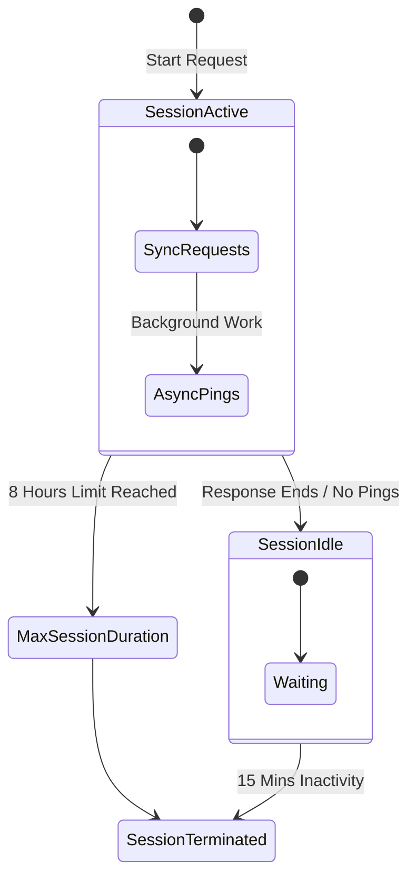

Most AI demos fail in the real world for two reasons: **Amnesia** and **Timeouts**.

A standard Lambda function dies after 15 minutes. A standard chat bot forgets context when the session ends. But enterprise workflows—like investigating financial fraud or onboarding a new employee—take days, not minutes.

**AWS Bedrock AgentCore** is the answer. It provides a managed runtime that supports 8-hour sessions and persistent memory. This guide breaks down the architecture and shows you how to build it.

## The Architecture: Supervisor and Workers

We don't build one giant agent. We build a system.


Imagine that each `session manager(agent)` in the diagram has a role below:

*   **Supervisor:** The "Boss." It takes the user request ("Investigate TechCorp") and delegates work.
*   **Retrieval Agent:** The "Researcher." It checks internal databases.
*   **Compliance Agent:** The "Lawyer." It waits for bank data (which might take 3 days) and then files a report.

## The Session Lifecycle

Unlike a standard container that spins down immediately, an AgentCore session has a state machine designed for the long running process (up to 8 hours).



1.  **Active:** The agent is processing or waiting for a tool.
2.  **Idle:** The agent goes to sleep to save money but keeps its state.
3.  **Terminated:** after 15 minutes of silence (configurable) or 8 hours total.

## Configuration Guide

To deploy this, you package your agent code (Python/LangChain) into a Docker container and push it to ECR. Then, you configure the AgentCore Runtime.

### 1. Dockerfile Setup

Wrap your agent with the `bedrock-agentcore-runtime` base image.

```dockerfile
FROM public.ecr.aws/bedrock-agentcore/runtime:latest

# Install dependencies
COPY requirements.txt .
RUN pip install -r requirements.txt

# Copy your agent code
COPY src/ .

# The entrypoint is handled by the base image, 
# just ensure your agent exposes the standard interface.
```

### 2. Runtime Configuration (Python SDK)

Use the `bedrock_agentcore_starter_toolkit` to configure the runtime in your `app.py`.

```python
from bedrock_agentcore_starter_toolkit import Runtime

def create_app():
    # Define the runtime config
    config = {
        "max_session_duration_seconds": 28800,  # 8 Hours
        "idle_timeout_seconds": 900             # 15 Minutes
    }
    
    # Initialize runtime
    runtime = Runtime(config=config)
    return runtime.start()

if __name__ == "__main__":
    create_app()
```

## Persistent Memory

The "magic" that allows an agent to wake up after 3 days and remember "Day 0" is **AgentCore Memory**.

It automatically separates storage:
*   **Short Term:** Raw chat logs and events (access restricted to the specific `actorId`).
*   **Long Term:** Summarized insights (stored in namespaced "folders").


## Security Best Practice

Use **Conditional Keys** in your IAM policies to ensure Tenant A never reads Tenant B's memory.

```json
{
    "Version": "2012-10-17",
    "Statement": [
        {
            "Effect": "Allow",
            "Action": ["bedrock:Retrieve"],
            "Resource": "*",
            "Condition": {
                "StringEquals": {
                    "bedrock-agentcore:actorId": "${aws:PrincipalTag/TenantID}"
                }
            }
        }
    ]
}
```

## Conclusion

AgentCore allows you to move from "Prompt Engineering" to "System Engineering." By handling the infrastructure of long-running sessions and state management, you can focus on the business logic of your agents.

**References:**
*   [AWS Bedrock AgentCore Documentation](https://aws.amazon.com/bedrock/agents/)
