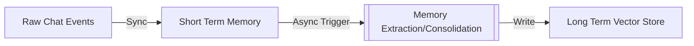

Standard LLM applications suffer from "Party Amnesia." You have a great conversation, close the window, and 5 minutes later the agent asks, "Who are you?"

**AWS AgentCore Memory** solves this by moving context out of the ephemeral session and into a persistent, managed layer. This article details the technical architecture of how that works.

## The Architecture: Context Orchestrator

The "Context Orchestrator" is the brain that assembles the prompt before the LLM ever sees it. It combines **Authoritative Context** (what is factually true) with **Conversational Context** (what is personally relevant).


```mermaid
flowchart TD  
    UserQuery[User Query] --> Orchestrator[Context Orchestrator]  
      
    subgraph Authoritative["What is True?"]
        KB[Knowledge Bases]  
        API[Real-time API Data]  
    end  
      
    subgraph Conversational["What is Personal?"]  
        STM[Short-term Memory]  
        LTM[Long-Term Memory]  
    end
    
    Orchestrator --> AuthContext[Merge Context]
    Authoritative --> AuthContext
    Conversational --> AuthContext
    
    AuthContext --> LLM[LLM Reasoning]  
```

## Short-Term vs. Long-Term Memory

AgentCore splits memory into two distinct pipelines to balance speed and retention.

*   **Short-Term Memory (STM):** Synchronous. Stores raw events (User said X, Agent said Y). Accessible immediately.
*   **Long-Term Memory (LTM):** Asynchronous. A background process extracts "Insights" and "Summaries" from the STM and stores them in a Vector Store.



## Implementation: Memory Strategies

You configure "Strategies" to tell the agent *what* to remember.

1.  **Summary:** Condenses the last N messages.
2.  **User Preference:** Detects and saves likes/dislikes (e.g., "I hate spicy food").
3.  **Semantic:** Saves factual statements (e.g., "My user ID is 12345").

### Configuring Strategies (JSON)

```json
{
  "strategies": [
    {
       "type": "USER_PREFERENCE",
       "configuration": {
          "topic": "food_preferences",
          "retention_period": 90 // Days
       }
    },
    {
       "type": "SUMMARY",
       "configuration": {
          "max_tokens": 500
       }
    }
  ]
}
```

## The Hook System

For enterprise control, you don't always want to rely on the LLM to decide when to save. You can use **Memory Hooks** to force deterministic behavior.

```python
class MyMemoryHook(MemoryHook):
    def on_message_added(self, event):
        """
        Triggered every time a message is added to the session.
        """
        current_message = event.message.content
        
        # Deterministic check: If user mentions 'budget', save it explicitly
        if "budget" in current_message.lower():
            self.memory_client.save_insight(
                insight={
                    "key": "project_budget",
                    "value": extract_budget(current_message),
                    "confidence": 1.0
                }
            )
```

## Security and Isolation

AgentCore enforces strict isolation. Data is encrypted at rest and in transit.

*   **Namespace Isolation:** Every user's memory is stored in a separate logical namespace (e.g., `user/alice/preferences`).
*   **Cross-Agent Interoperability:** If configured, the "Sales Agent" can read the `user/alice` namespace populated by the "Support Agent," creating a unified customer view.

## Conclusion

By decoupling memory from the runtime, AgentCore allows you to build agents that "grow up" with your users, remembering details over months instead of minutes.

**References:**
*   [AWS Bedrock AgentCore Memory Documentation](https://aws.amazon.com/bedrock/agents/)
