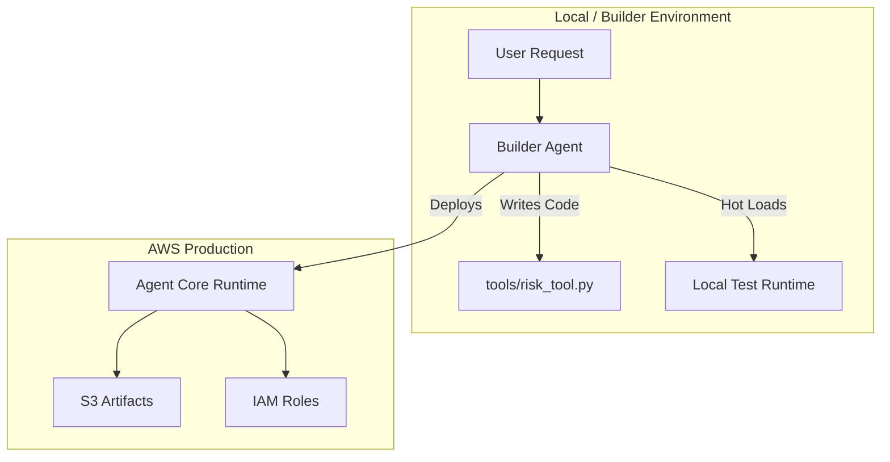

Building a single AI agent is easy. Building 100 secure, production-grade agents is an operations nightmare.

The **AWS Agent Factory** solves this by treating agents as manufactured goods. You don't hand-code every file; you use a **Builder Agent** to generate the code, infrastructure, and deployment artifacts for you.

## The Factory Architecture

The factory relies on **Strands**, a model-driven SDK, to dynamically generate Python code for new agents.




## Step 1: Meta-Tooling (Agents Writing Agents)

The Builder Agent isn't just a chatbot. It uses the `Strands` SDK to write actual python code.

For example, if you ask for a "Stock Analyzer," the Builder Agent generates a new file `tools/stock_tool.py` using the `@add_tool` decorator.

```python
# Generated by Builder Agent
from strands import tool

@tool
def analyze_stock(ticker: str) -> dict:
    """Gets stock data for a given ticker."""
    # ... logic ...
    return {"price": 100, "rating": "BUY"}
```

The system watches the `tools/` directory. When this file appears, it **Hot Loads** the new capability instantly.

## Step 2: Implementation Details

You can customize the underlying model for your agents using `BedrockModel`.

```python
from strands.model import BedrockModel
from strands import Agent

# Switch to a faster model for the worker agent
fast_model = BedrockModel(
    model_id="anthropic.claude-3-haiku-20240307-v1:0",
    temperature=0.0
)

worker_agent = Agent(
    model=fast_model,
    tools=[analyze_stock],
    system_prompt="You are a financial analyst..."
)
```

## Step 3: Production Deployment

Once the agent is tested locally, the Factory automates the move to the cloud. It replaces manual Terraform/CDK writing with a single CLI command.

```bash
# Configure AWS resources (S3, ECR, IAM)
agent-core configure

# Run the Builder to deploy the specific agent
python builder_agent.py --deploy
```

This command:
1.  **Containerizes** the agent code.
2.  Creates an **IAM Execution Role** with least-privilege permissions.
3.  Uploads the artifact to **Amazon S3**.
4.  Updates the **Agent Core Gateway**.

## Conclusion

The Agent Factory shifts the paradigm from "crafting pets" to "manufacturing cattle." By automating the boilerplate of IAM, S3, and standard tool definitions, you can spin up a dedicated agent for every micro-task in your enterprise.

**References:**
*   [Agent Factory Repository](https://github.com/mcginnbros/agent-factory)
