Moving from a single agent to a multi-agent system is not just about adding more bots. It's about structure.

This guide details the four canonical architectures for multi-agent systems and introduces the advanced **ReWOO** pattern for optimization.

## 1. Hierarchical (The "Boss and Workers")

This is the standard for complex business workflows. A Supervisor delelgates tasks to specialized workers.

**Best For:** Context Hiding. The Supervisor never sees the raw "junk" data (like HTML scraping) from the worker, keeping its memory clean.

```mermaid
graph TD  
    Supervisor((🧠 Supervisor))  
    Supervisor -->|Delegates| ManagerA[Manager A]
    Supervisor -->|Delegates| ManagerB[Manager B]
      
    ManagerA -->|Task| Worker1[Worker 1]  
    ManagerA -->|Task| Worker2[Worker 2]
```

### The "Context Hiding" Pattern

One of the biggest advantages of this hierarchy is memory management.

## 2. Multi-Agent DAG (The Assembly Line)

A **Directed Acyclic Graph (DAG)** is a fixed chain.

**Best For:** Predictable pipelines like document processing.

## 3. ReWOO: Reasoning Without Observation

**ReWOO** decouples the "Planning" from the "Doing." This reduces token usage and latency.

1.  **Planner:** Generates a full plan with placeholders (`#E1`, `#E2`).
2.  **Worker:** Executes tools in parallel to fill placeholders.
3.  **Solver:** Synthesizes the final answer.

```mermaid
graph TD  
    subgraph "Phase 1: Planning"  
    Planner[📝 Planner] -->|Plan| Plan[Plan: #E1, #E2]  
    end

    subgraph "Phase 2: Execution"  
    Plan --> Worker[👷 Worker]  
    Worker -->|Parallel Tool Call| ToolA[Output #E1]  
    Worker -->|Parallel Tool Call| ToolB[Output #E2]  
    end

    subgraph "Phase 3: Synthesis"  
    ToolA --> Solver[🧩 Solver]  
    ToolB --> Solver  
    Solver --> Final[Answer]  
    end
```

## Decision Document: Hierarchical vs. DAG

| Feature | Hierarchical | DAG |
| :--- | :--- | :--- |
| **Flexibility** | High (Can change plan mid-flight) | Low (Hardcoded path) |
| **Latency** | Higher (Supervisor "thinking" time) | Lower (Immediate routing) |
| **Use Case** | Customer Support, Research | Onboarding, Claims Processing |

**Conclusion:** Start with Hierarchical for most "Assistant" type apps. Use DAGs for backend automation.
