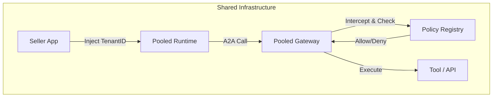

In a multi-tenant Agent SaaS, sharing the "Brain" (Runtime) saves money, but sharing the "Memory" (Database) risks a massive data breach.

This guide implements the **Pool Pattern**: A shared runtime with logical isolation enforced by **Tenant Context**.

## The Architecture: Pool Pattern

Every request flows through a chain of validation, carrying a `TenantID`.



## 1. Tool Access Control (Gateway Interceptors)

You can't trust the LLM to "not use" a tool. You must block it at the network layer.

The **Policy Registry** returns a JSON policy that the Gateway enforces.

```json
{
  "policyId": "POL-TENANT-A",
  "tenantId": "Tenant-A",
  "rules": [
    {
      "effect": "ALLOW",
      "resourceType": "TOOL",
      "resources": ["agent:tool:order-lookup"]
    },
    {
      "effect": "DENY",
      "resourceType": "TOOL",
      "resources": ["agent:tool:admin-refund"],
      "reason": "Insufficient privileges"
    }
  ]
}
```

## 2. Memory Isolation (IAM Trust Policy)

AgentCore Memory requires AWS IAM credentials, not JWTs. The Runtime performs a **Token Exchange**, swapping the user's JWT for a temporary IAM Role tagged with the `TenantID`.

You enforce isolation using Attribute-Based Access Control (ABAC) in your IAM Policy:

```json
{
    "Version": "2012-10-17",
    "Statement": [
        {
            "Sid": "EnforceTenantIsolation",
            "Effect": "Allow",
            "Action": ["bedrock:Retrieve"],
            "Resource": "arn:aws:bedrock:knowledge-base/*",
            "Condition": {
                "StringEquals": {
                    // The Principal (Agent) Tag MUST match the Resource (Data) Tag
                    "aws:ResourceTag/TenantID": "${aws:PrincipalTag/TenantID}"
                }
            }
        }
    ]
}
```

## 3. Identity: Act-on-Behalf

Never use "Impersonation" (pretending the Agent *is* the User).
Use **Act-on-Behalf** (The Agent acts *for* the User).

*   **Principal:** Agent Service
*   **Subject:** User Alice
*   **Scope:** Read-Only

## Implementation Checklist

*   [ ] **Registry:** Build a DynamoDB table mapping `User -> Tenant -> Policy`.
*   [ ] **Interceptor:** Create a Lambda function for the Gateway to check the Registry.
*   [ ] **STS Exchange:** Configure Runtime to AssumeRole with `TenantID` tags.
*   [ ] **Zero Trust:** Ensure `TenantID` is propagated in every A2A call header.
