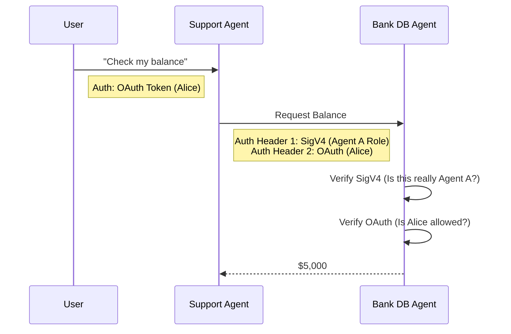

For a bank, an AI agent isn't just a chatbot; it's a potential attack vector. If "Agent A" (Customer Support) calls "Agent B" (Transaction Handler), how do we trust that call?

We implement a **Zero Trust Mesh** using **AgentCore Identity**.

## 1. Identity Propagation

In a monolithic app, you check the user's ID once at the front door. In a multi-agent mesh, that ID must travel with every hop.

**The Solution:** AgentCore automatically propagates the `X-Amzn-Bedrock-AgentCore-Runtime-Session-Id` and the User's OIDC token.

*   **Hop 1:** User -> Support Agent (Auth: User JWT)
*   **Hop 2:** Support Agent -> Transaction Agent (Auth: User JWT + Agent SigV4)

This allows the Transaction Agent to enforce **Row-Level Security** (RLS). It knows that even though the "Support Agent" is calling, the *actual user* is "Alice," so it only returns Alice's data.

## 2. Inbound Auth: AWS SigV4

Every agent-to-agent call is signed using **AWS Signature Version 4 (SigV4)**. This provides cryptographic proof of the *caller's* identity (the AWS IAM Role of the calling agent).

## 3. Network Isolation (PrivateLink)

For financial compliance (SOC2, PCI-DSS), traffic must never traverse the public internet.

AgentCore Runtime supports **AWS PrivateLink**. The entire mesh—Agents, Gateway, and Memory—runs inside your **Virtual Private Cloud (VPC)**.

## Conclusion

Security cannot be an afterthought. By utilizing Identity Propagation and PrivateLink, financial institutions can deploy autonomous agents that are as secure as their existing microservices.
