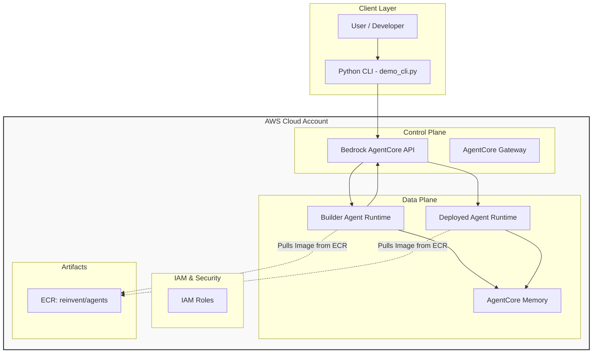

In the rapidly evolving world of Generative AI, manually deploying agents one by one is no longer sexy. We need systems that can build systems—an **Agent Factory**.


Today, we will dissect the Agent Factory system I learned at `AWS re:Invent 2025`. AWS engineers built a system that can build agents using AWS AgentCore, and the repo is [https://github.com/mcginnbros/agent-factory](https://github.com/mcginnbros/agent-factory).

This platform is designed to bootstrap your personal AWS environment into a fully functional agent ecosystem using AWS AgentCore.

In this post, we'll peel back the layers and look at the infrastructure that makes this possible: from IAM policies and ECR repositories to the Python tooling that orchestrates it all.

---

## 1. The Core Architecture

At the heart of this system lies the concept of a **Builder Agent**. Instead of writing Terraform or CloudFormation for every new agent you want to experiment with, you talk to the Builder Agent. 

The Builder Agent comprises:
1.  **Strands Framework**: The application logic driving the agent's reasoning.
2.  **AWS AgentCore Runtime**: The serverless compute environment hosting the agent container.
3.  **Tooling Access**: Permissions to call AWS APIs to create *other* resources.

When you ask the Builder Agent to "Create a weather bot," it doesn't just write code; it provisions real infrastructure. 🤯

## 2. Infrastructure Under the Hood

To enable a safe yet powerful Agent Factory, we lean heavily on AWS native services.



### Identity and Access Management (IAM)
Security is paramount when an AI agent has permission to deploy infrastructure. We utilize specific IAM roles with carefully scoped trust policies.

*   **`AgentCoreExecutionRole`**: This is the primary identity for our agents.
    *   **Trust Policy**: Allows `bedrock-agentcore.amazonaws.com` to assume this role.
    *   **Permissions**: 
        *   `AgentCoreBradrockAccess`: Invoke models (Claude Sonnet/Haiku).
        *   `AgentCoreECRAccess`: Pull Docker images from our private ECR.
        *   `AgentCoreLambdaInvoke`: Call Lambda functions (used for tools).
        *   `AgentCoreA2AAccess`: Communicate with other agents via the A2A protocol.

### Elastic Container Registry (ECR)
We use a centralized repository named **`reinvent/agents`** to store our agent images. 
*   **Base Image**: Contains heavy dependencies (Python, Strands, Playwright).
*   **Generic Agent Image**: A standardized template that can load specific configurations at runtime.
*   **Builder Image**: The specialized image for our factory orchestrator.

### AgentCore Memory
We provision a shared **AgentCore Memory** instance (`reinvent_agent_factory-shared`) that allows agents to retain context across sessions.

---

## 3. Deep Dive: Inside the Builder Agent

The `builder_agent` directory is the gold mine of this project. It orchestrates the creation of other agents using a "Generic Agent" strategy.

### The Generic Agent Pattern
Instead of building a unique Docker image for every new bot (which takes minutes), we use a single **Generic Agent Container**.

*   **`templates/generic_agent.py`**: This script is the entry point for *all* deployed agents.
*   **Dynamic Configuration**: Behavior is injected at runtime via Environment Variables (`SYSTEM_PROMPT`, `AGENT_MODE`, `ENABLE_BROWSER`).

This allows the Builder Agent to deploy a new agent in seconds by simply pointing a new Runtime to the existing ECR image.

### Agent Modes: Server vs. Client
The platform supports two distinct modes of operation:

#### **Server Mode (`AGENT_MODE='server'`)**
*   **Purpose**: To provide tools or services to other agents.
*   **Mechanism**: Starts a **FastAPI server on port 9000**.
*   **Protocol**: Exposed via the **Agent-to-Agent (A2A)** protocol.
*   **Usage**: The AgentCore Gateway routes requests to this port.

#### **Client Mode (`AGENT_MODE='client'`)**
*   **Purpose**: To consume services and orchestrate tasks.
*   **Mechanism**: Runs a loop processing user input; does *not* listen on a port.
*   **Capabilities**: Initialized with `KNOWN_AGENT_IDS` to call Server agents.

### Docker Layering Strategy
We use a `FROM ...:base` pattern in our Dockerfiles. We verify that a base image (containing heavy libraries like `strands`, `boto3`, `playwright`) exists first. The Builder's Dockerfile then just copies the lightweight Python scripts on top. This ensures builds are lightning fast.

---

## 4. Interacting with the AgentCore SDK

The `demo_cli.py` provides a practical example of how to interact with the AgentCore service using `boto3`.

### Two Distinct Clients

```python
# 1. Runtime Client: For invoking agents
self.client = boto3.client("bedrock-agentcore", region_name=REGION)

# 2. Control Plane Client: For managing resources (deploy, list, delete)
self.control_client = boto3.client("bedrock-agentcore-control", region_name=REGION)
```

### Listing and Inspecting Agents
We use the control client to inspect configuration details, such as checking for the A2A protocol and to see what agents are running.

```python
# List all runtimes
response = self.control_client.list_agent_runtimes()

for runtime in response.get("agentRuntimes", []):
    agent_id = runtime["agentRuntimeId"]
    
    # Get full details to check protocol configuration
    details = self.control_client.get_agent_runtime(agentRuntimeId=agent_id)
    
    # Check if A2A is enabled
    protocol_config = details.get("protocolConfiguration", {})
    has_a2a_protocol = (protocol_config.get("serverProtocol") == "A2A")
```

#### Invoking Agents: Simple vs. JSON-RPC

When sending messages to an agent using the runtime `client`, the payload format differs based on the agent's mode:

1.  **Standard Agents**: Use a simple JSON payload.
2.  **A2A Agents**: Use the JSON-RPC 2.0 standard.

```python
# Prepare payload based on protocol
if use_jsonrpc:
    # A2A Agents expect JSON-RPC 2.0
    payload = {
        "jsonrpc": "2.0",
        "method": "message/send",
        "params": {
            "message": {
                "kind": "message",
                "role": "user",
                "parts": [{"kind": "text", "text": message}],
                "messageId": f"msg-{uuid.uuid4().hex[:8]}"
            }
        },
        "id": request_id
    }
else:
    # Standard Agents accept simple JSON
    payload = {"prompt": message}

# Invoke the agent
response = self.client.invoke_agent_runtime(
    agentRuntimeArn=agent_arn,
    runtimeSessionId=session_id,  # Maintains conversation state
    payload=json.dumps(payload),
    qualifier="DEFAULT"
)
```

This dual-mode support allows the platform to handle both simple standalone bots and complex, interconnected agent swarms.

---

## 5. Developer Experience: Python, uv, and Automation

Managing dependencies in modern Python projects can be complex. One thing I added from the original repo is utilizing [**uv**](https://github.com/astral-sh/uv), an extremely fast Python package installer and resolver.

We leverages `uv` to ensure reproducible builds. We've also automated the entire bootstrapping process with `scripts/setup_aws_resources.py`, which handles:
1.  Detecting AWS Account/Region.
2.  Creating IAM Roles and ECR Repositories.
3.  Building and pushing Docker images.
4.  Generating the local `.env` configuration.

---

## 6. Getting Started

If you have the repository cloned, setting up your own Agent Factory is straightforward using `uv`:

### 1. Configure Credentials
```bash
cd agent-factory
pip install uv
uv --version        # check uv is installed
uv init             # initializing uv project and adding dependencies
aws configure
```

### 2. Initialize Environment
```bash
uv sync
```

### 3. Provision Infrastructure
```bash
uv run scripts/setup_aws_resources.py
```
This script acts as your bootstrap "Infrastructure as Code".
It uses `boto3` to:

1.  Detect your AWS Account ID and Region.
2.  Check for and create missing IAM Roles.
3.  Create the `reinvent/agents` ECR repository.
4.  Authenticate Docker with ECR.
5.  Build and push the necessary Docker images.
6.  Generate a local `.env` file for your client configuration. (do not forget to add it to `.gitignore` :))

### 4. Deploy Builder & Run CLI
```bash
uv run scripts/deploy_builder.py
uv run demo_cli.py
```


You can now chat with the Builder Agent and ask it to create new bots for you!
