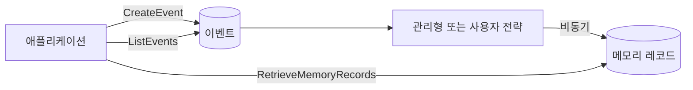

에이전트 메모리는 사용자를 저절로 기억하는 하나의 데이터베이스가 아니다. Amazon Bedrock AgentCore Memory에는 구체적인 데이터 모델이 있다. 메모리 리소스는 변경할 수 없는 단기 이벤트를 저장하고, 설정된 전략이 이벤트에서 장기 메모리 레코드를 비동기로 만든다. 애플리케이션은 actor와 session 식별자, 네임스페이스, 보존 기간, 검색 방식, 권한을 직접 설계해야 한다.

## 현재 데이터 모델

이벤트는 `memoryId`, `actorId`, `sessionId`에 연결된 시간순 상호작용이다. 대화 한 차례, 도구 결과, 애플리케이션 동작을 이벤트로 남길 수 있다. 단기 이력은 actor와 session 기준으로 읽는다. 메모리 리소스에 전략을 설정하면 해당 전략이 이벤트를 처리해 장기 검색용 레코드를 만든다.

기본 전략은 의미상 사실, 요약, 사용자 선호, 에피소드 같은 일반적인 요구를 다룬다. 추출 규칙이 결정적이어야 하거나 별도 감사를 받아야 하거나 도메인 로직이 필요하다면 self-managed 전략을 선택한다. 애플리케이션이 직접 추출한 뒤 배치 레코드 API로 적재하는 방식이며, 존재하지 않는 `save_insight` 훅을 가정할 필요가 없다.



이벤트 쓰기와 장기 검색의 일관성은 다르다. 방금 쓴 이벤트는 단기 이력에서 읽을 수 있지만 파생 레코드는 즉시 나타나지 않을 수 있다. 프롬프트 조립 과정은 이 지연을 정상 상황으로 처리해야 한다.

## 지원되는 API로 이벤트를 기록한다

아래 SDK 도우미는 문서화된 세션 모델을 따르며 actor와 session을 명시적으로 다룬다.

```python
from bedrock_agentcore.memory import MemorySessionManager
from bedrock_agentcore.memory.constants import ConversationalMessage, MessageRole

manager = MemorySessionManager(memory_id=MEMORY_ID, region_name="us-west-2")
session = manager.create_memory_session(
    actor_id=stable_actor_id,
    session_id=conversation_id,
)
session.add_turns(messages=[
    ConversationalMessage("업데이트는 이메일로 받고 싶어요.", MessageRole.USER),
    ConversationalMessage("이메일로 알려드릴게요.", MessageRole.ASSISTANT),
])
```

`stable_actor_id`는 인증이 끝난 뒤 신뢰할 수 있는 애플리케이션 계층에서 만든다. 브라우저가 보낸 임의의 actor ID를 그대로 넘기면 안 된다. session ID는 추측하기 어려운 고유 값으로 만들고 서버 상태에서 인증된 actor와 묶는다.

비밀번호, 접근 토큰, 결제 정보, 불필요한 개인정보는 이벤트에 넣지 않는다. 추출 과정에서 민감한 입력이 장기 레코드로 복사될 수 있다. 쓰기 전에 가리고 이벤트 만료 기간을 정하며 삭제와 정보 열람 절차를 마련한다.

## 네임스페이스도 인터페이스다

네임스페이스는 전략이 만든 레코드를 정리한다. 프롬프트 안에서 문자열을 즉흥적으로 이어 붙이지 말고 문서화된 템플릿 변수를 사용한다. actor 단위의 전형적인 형태는 다음과 같다.

```text
/strategy/{memoryStrategyId}/actor/{actorId}/
```

세션 사이에 기억을 공유하면 안 될 때만 `{sessionId}`를 추가한다. 전역 네임스페이스는 의도적으로 공유하는 비사용자 데이터에만 쓴다. 네임스페이스 의미가 달라진다면 버전을 올린다. 구조를 바꾸면 기존과 신규 레코드가 다른 경로에 남는 마이그레이션 문제가 생긴다.

네임스페이스는 권한 체계가 아니다. 메모리 리소스 ARN을 제한하고 `bedrock-agentcore:namespace` 또는 `bedrock-agentcore:namespacePath` 같은 IAM 조건 키로 검색 범위를 강제한다. 애플리케이션도 인증된 신원과 허용된 경로를 신뢰할 수 있게 매핑해야 한다.

## 검색과 프롬프트 조립

현재 작업에 필요한 전략과 네임스페이스만 검색한다. 결과 수를 작게 제한하고 관련성을 확인하며 메모리를 신뢰하지 않은 컨텍스트로 표시한다. 기억된 문장이 시스템 정책을 덮어쓰지 못하게 해야 한다. 잔액, 권한, 승인처럼 반드시 정확해야 하는 사실은 메모리가 아니라 원본 서비스에서 읽는다.

actor, session, 이벤트 ID, 전략, 네임스페이스, 생성 시각과 추출 버전을 추적하면 기억이 나타난 이유를 설명하고 잘못된 레코드를 제거할 수 있다.

## 이전과 평가

사용자 정의 훅은 `CreateEvent` 또는 SDK 세션 도우미로 바꾼다. 기존 사용자는 안정적인 actor로, 기존 대화는 session으로 매핑한다. 가져오기 전에 전략과 네임스페이스를 정하고, 검토를 마친 과거 사실은 self-managed 배치 API로 넣는다. 체크포인트와 대조 보고서를 남긴다.

평가는 회상 정확도만 보면 부족하다. 다른 actor와 tenant의 접근 거부, 추출 지연, 삭제, 기억 속 프롬프트 인젝션, 상충하는 업데이트, 빈 검색 결과, 전략 변경을 시험한다. 유용한 기억이 작업 성공률을 높이면서 정보 누출을 만들거나 원본 데이터를 밀어내지 않는지 측정해야 한다.

## 참고 자료

- [AgentCore Memory 시작하기](https://docs.aws.amazon.com/bedrock-agentcore/latest/devguide/memory-get-started.html)
- [Memory 용어](https://docs.aws.amazon.com/bedrock-agentcore/latest/devguide/memory-terminology.html)
- [네임스페이스로 장기 메모리 구성하기](https://docs.aws.amazon.com/bedrock-agentcore/latest/devguide/specify-long-term-memory-organization.html)
- [Self-managed 메모리 전략](https://docs.aws.amazon.com/bedrock-agentcore/latest/devguide/memory-self-managed-strategies.html)

_2026-08-01 기준 공식 문서를 확인했다._
