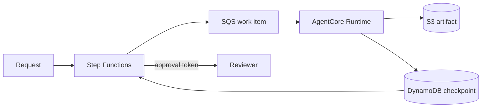

Amazon Bedrock AgentCore Runtime can run asynchronous work for up to eight hours. That is useful, but it is not the same as durable execution. A fraud investigation that waits two days for a document, or an onboarding flow paused for manager approval, cannot depend on one runtime session staying alive.

The useful boundary is simple: AgentCore Runtime performs bounded agent work; a durable orchestrator owns the business process.

## Separate runtime state from workflow state

Treat a runtime invocation as replaceable. Give it an idempotent unit of work, persist results outside the runtime, and let AWS Step Functions or another durable workflow engine decide what happens next.



Use AgentCore Memory for conversational continuity, preferences, and extracted knowledge. Do not use it as the source of truth for job status, approvals, money movement, or exactly-once processing. Those belong in a transactional store with explicit state transitions.

## Define a restart-safe work contract

Every work item should carry a stable job ID, step ID, attempt number, input reference, and output location. Avoid putting large or sensitive payloads directly on a queue.

```json
{
  "jobId": "case-8f2c",
  "stepId": "summarize-evidence",
  "attempt": 2,
  "input": "s3://private-case-data/case-8f2c/manifest.json",
  "output": "s3://private-case-data/case-8f2c/summary.json"
}
```

Before doing expensive work, conditionally claim the step in DynamoDB. Write the result to a versioned object, then conditionally mark the step complete. A retry should return the existing result instead of repeating an external action. For side-effecting tools, pass an idempotency key through to the downstream API when it supports one.

The agent should emit structured progress rather than relying on an open HTTP response:

```python
def handle_step(item, jobs, artifacts):
    key = {"job_id": item["jobId"], "step_id": item["stepId"]}
    if jobs.is_complete(key):
        return jobs.result(key)
    lease = jobs.claim(key, attempt=item["attempt"])
    result = run_bounded_agent_task(item["input"])
    uri = artifacts.put_json(item["output"], result)
    jobs.complete(key, lease=lease, result_uri=uri)
    return {"resultUri": uri}
```

This is application-level pseudocode: the important part is the conditional claim and completion, not a particular library.

## Heartbeats are liveness, not durability

AgentCore Runtime supports background tasks and reports status through its runtime contract. Keep the runtime responsive to health checks while background work runs, and stay within the documented execution limit. A heartbeat only says the current process is alive; it does not recreate lost work after termination.

Split work that might approach the limit. For example, process a corpus in batches and checkpoint after each batch. Let the orchestrator start the next invocation. If a task cannot be divided, run it on a compute service whose lifetime matches the task, while using AgentCore only for the reasoning steps.

## Human approval and external callbacks

Never keep an invocation open while waiting for a person. Store the proposed action, stop processing, and use a Step Functions callback task or an application event to resume. Bind approval to the job, proposed action digest, approver, and expiry time. Revalidate authorization when resuming because permissions and input data may have changed.

## Security and operations

- Give the runtime role access only to the queue, table rows, artifact prefix, models, and tools it needs.
- Encrypt artifacts, avoid secrets in prompts and logs, and define retention for intermediate data.
- Treat tool output and retrieved documents as untrusted input. Validate schemas and require policy checks outside the model for consequential actions.
- Record job ID, step ID, runtime session ID, model version, prompt/template version, tool calls, and result URI in traces.
- Put bounded retries on transient failures, then route exhausted work to a dead-letter queue. Do not retry policy denials or malformed input.

## Migration from a single long session

First inventory everything held only in process memory. Move business state and artifacts to durable stores. Divide the flow into restartable steps and add idempotency. Put waiting states in the orchestrator. Finally, kill workers during a staging run and verify the workflow resumes without duplicate side effects.

Evaluate the design with four tests: a retry after a model timeout, termination midway through a batch, approval after the original session has expired, and duplicate delivery of the same queue message. The job is durable only when all four produce one correct final outcome.

## References

- [How AgentCore Runtime works](https://docs.aws.amazon.com/bedrock-agentcore/latest/devguide/runtime-how-it-works.html)
- [AgentCore Runtime service contract](https://docs.aws.amazon.com/bedrock-agentcore/latest/devguide/runtime-service-contract.html)
- [AWS Step Functions callback tasks](https://docs.aws.amazon.com/step-functions/latest/dg/connect-to-resource.html#connect-wait-token)
- [Amazon SQS visibility timeout](https://docs.aws.amazon.com/AWSSimpleQueueService/latest/SQSDeveloperGuide/sqs-visibility-timeout.html)

_Reviewed against official documentation on 2026-08-01._
