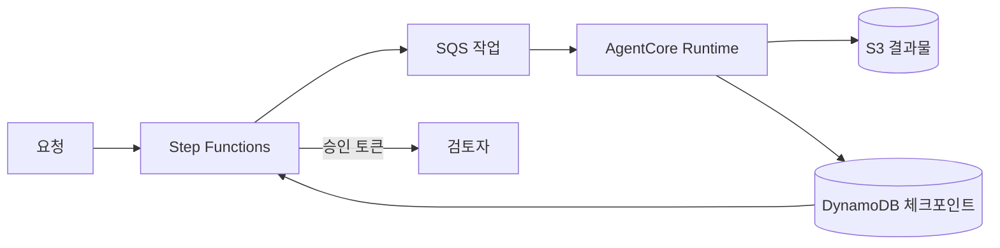

Amazon Bedrock AgentCore Runtime은 비동기 작업을 최대 8시간 실행할 수 있다. 꽤 긴 시간이지만 이를 내구성 있는 실행과 같은 뜻으로 받아들이면 안 된다. 서류를 이틀 기다리는 금융 조사나 관리자의 승인을 기다리는 온보딩 절차는 하나의 런타임 세션이 계속 살아 있다는 가정 위에 세울 수 없다.

경계는 명확하게 잡는 편이 좋다. AgentCore Runtime은 시간이 제한된 에이전트 작업을 수행하고, 업무 절차의 상태는 AWS Step Functions 같은 내구성 있는 오케스트레이터가 소유한다.

## 런타임 상태와 업무 상태를 분리한다

런타임 호출은 언제든 교체될 수 있다고 가정한다. 멱등성이 있는 작업 단위를 넘기고, 결과를 외부 저장소에 남기며, 다음 단계는 워크플로 엔진이 결정하게 한다.



AgentCore Memory는 대화의 연속성, 사용자 선호, 추출된 지식을 보존하는 데 적합하다. 작업 상태, 승인, 금전 처리, exactly-once 실행의 원장으로 사용해서는 안 된다. 이런 상태는 명시적인 전이를 지원하는 트랜잭션 저장소에 둔다.

## 재시작 가능한 작업 계약

작업 메시지에는 안정적인 작업 ID와 단계 ID, 시도 횟수, 입력 참조, 출력 위치를 넣는다. 크거나 민감한 원문을 큐에 직접 넣는 방식은 피한다.

```json
{
  "jobId": "case-8f2c",
  "stepId": "summarize-evidence",
  "attempt": 2,
  "input": "s3://private-case-data/case-8f2c/manifest.json",
  "output": "s3://private-case-data/case-8f2c/summary.json"
}
```

비용이 큰 처리를 시작하기 전에 DynamoDB 조건부 쓰기로 단계를 선점한다. 결과는 버전이 있는 객체로 저장하고, 같은 방식으로 완료 상태를 기록한다. 재시도는 외부 동작을 반복하지 않고 기존 결과를 돌려줘야 한다. 외부 API가 멱등성 키를 지원한다면 도구 호출까지 같은 키를 전달한다.

```python
def handle_step(item, jobs, artifacts):
    key = {"job_id": item["jobId"], "step_id": item["stepId"]}
    if jobs.is_complete(key):
        return jobs.result(key)
    lease = jobs.claim(key, attempt=item["attempt"])
    result = run_bounded_agent_task(item["input"])
    uri = artifacts.put_json(item["output"], result)
    jobs.complete(key, lease=lease, result_uri=uri)
    return {"resultUri": uri}
```

이는 특정 SDK 사용법이 아니라 애플리케이션 구조를 보여주는 의사 코드다. 핵심은 조건부 선점과 완료 처리다.

## 하트비트는 생존 신호일 뿐이다

AgentCore Runtime은 백그라운드 작업과 상태 확인 계약을 제공한다. 작업 중에도 상태 확인에 응답하고 문서에 명시된 실행 한도를 지켜야 한다. 그러나 하트비트는 현재 프로세스가 살아 있다는 신호일 뿐, 종료된 프로세스의 작업을 복구하지 않는다.

실행 한도에 가까워질 수 있는 일은 배치로 나누고 배치마다 체크포인트를 남긴다. 다음 호출은 오케스트레이터가 시작한다. 분할할 수 없는 작업이라면 수명 주기가 맞는 컴퓨팅 서비스에서 실행하고 AgentCore는 추론 단계에만 사용한다.

## 사람의 승인과 외부 콜백

사람을 기다리며 호출을 열어 두지 않는다. 제안된 동작을 저장하고 처리를 끝낸 뒤 Step Functions 콜백 작업이나 애플리케이션 이벤트로 재개한다. 승인에는 작업 ID, 실행 내용의 해시, 승인자, 만료 시각을 묶는다. 재개 시점에는 권한과 입력 데이터가 달라졌을 수 있으므로 다시 검사한다.

## 보안과 운영

- 런타임 역할은 필요한 큐, 테이블 항목, 객체 경로, 모델과 도구에만 접근하게 한다.
- 결과물을 암호화하고 프롬프트와 로그에 비밀을 넣지 않으며 중간 데이터의 보존 기한을 정한다.
- 도구 출력과 검색 문서는 신뢰하지 않은 입력으로 취급한다. 스키마를 검사하고 중요한 동작은 모델 바깥의 정책 검사로 승인한다.
- 작업 ID, 단계 ID, 런타임 세션 ID, 모델과 프롬프트 버전, 도구 호출, 결과 URI를 추적한다.
- 일시적 장애만 제한적으로 재시도하고, 소진된 작업은 DLQ로 보낸다. 정책 거부와 잘못된 입력은 반복하지 않는다.

## 단일 장기 세션에서 이전하기

먼저 프로세스 메모리에만 있던 상태를 찾는다. 업무 상태와 결과물을 내구성 저장소로 옮기고, 흐름을 재시작 가능한 단계로 나눈 다음 멱등성을 추가한다. 기다리는 상태는 오케스트레이터에 맡긴다. 마지막으로 스테이징에서 작업자를 일부러 종료해 중복 부작용 없이 재개되는지 확인한다.

모델 타임아웃 뒤 재시도, 배치 중간의 강제 종료, 원래 세션이 끝난 뒤의 승인, 같은 메시지의 중복 전달을 시험하자. 네 경우 모두 하나의 올바른 최종 결과가 만들어져야 비로소 내구성 있는 작업이다.

## 참고 자료

- [AgentCore Runtime 동작 방식](https://docs.aws.amazon.com/bedrock-agentcore/latest/devguide/runtime-how-it-works.html)
- [AgentCore Runtime 서비스 계약](https://docs.aws.amazon.com/bedrock-agentcore/latest/devguide/runtime-service-contract.html)
- [AWS Step Functions 콜백 작업](https://docs.aws.amazon.com/step-functions/latest/dg/connect-to-resource.html#connect-wait-token)
- [Amazon SQS visibility timeout](https://docs.aws.amazon.com/AWSSimpleQueueService/latest/SQSDeveloperGuide/sqs-visibility-timeout.html)

_2026-08-01 기준 공식 문서를 확인했다._
