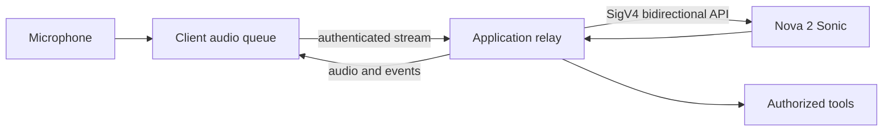

A good voice agent is not simply a text agent with speech recognition and synthesis attached. Users speak over it, change their minds while a tool runs, pause unpredictably, and expect private audio to disappear when the conversation ends. Amazon Nova 2 Sonic handles speech-to-speech interaction through Amazon Bedrock’s bidirectional streaming API, but the application still owns transport, playback, tools, identity, and consent.

## Put a trusted relay between browser and Bedrock

Do not place AWS credentials in a browser or mobile client. Capture microphone frames on the client and send them over a protected WebSocket or WebRTC connection to an authenticated backend. The backend uses SigV4 credentials to open `InvokeModelWithBidirectionalStream` and relays structured events.



Use the model ID documented for the deployment Region, currently `amazon.nova-2-sonic-v1:0` in the AWS getting-started example. Model availability changes, so keep it in validated configuration rather than hard-coding it across clients.

The API is event-driven. Start a session, start a prompt, then frame each piece of system, user, assistant, tool, or system-speech content with `contentStart`, its content event, and `contentEnd`. Maintain prompt, content, completion, session, and tool-use identifiers exactly as the protocol returns them. Use the official full-featured sample as the starting point; the basic sample intentionally omits true bidirectional behavior and barge-in.

## Make interruption a client state transition

When the user interrupts, Nova 2 Sonic stops generating speech and emits an interruption notification. The client must immediately stop the audio device and discard queued assistant audio associated with the interrupted completion. Merely stopping the network stream leaves buffered speech playing, which makes the agent appear to ignore the user.

Keep playback data keyed by completion ID. On interruption, invalidate that ID; reject late chunks from it; keep capturing microphone audio; and update the UI from “speaking” to “listening.” Test with headphones and speakers, because echo cancellation, device latency, and browser scheduling change behavior.

## Asynchronous tools need application control

Nova 2 Sonic can continue listening and responding while tools execute. A changed request does not automatically cancel an earlier tool, and the result is still delivered to the model. Therefore tool execution needs explicit lifecycle state.

```python
async def execute_tool(call, context):
    args = validate_schema(call.tool_name, call.content)
    authorize(context.principal, call.tool_name, args)
    result = await tools.run(
        call.tool_name, args,
        idempotency_key=call.tool_use_id,
        timeout_seconds=8,
    )
    return redact_and_bound(result)
```

The model’s tool selection is not authorization. Validate schemas, enforce tenant and resource ownership outside the model, set timeouts and size limits, and require confirmation for consequential actions. If an obsolete tool result returns after the user changes intent, mark its generation or request version so the application can prevent stale writes even though the result is delivered to the conversation.

For RAG, wrap retrieval as a read-only tool and return a small set of cited passages. Do not give retrieved text authority over system instructions. For complex workflows, call a durable service rather than hiding a long-running agent behind a voice tool timeout.

## Privacy and safety are product behavior

Ask for microphone permission in context and visibly show recording state. Offer mute and immediate end controls. Decide whether audio, transcripts, tool inputs, and synthesized responses are stored; default to the least retention compatible with the product. Redact sensitive values before general logging, encrypt retained artifacts, and document deletion.

Tell users they are speaking to AI. For regulated or high-impact actions, repeat the interpreted request and obtain confirmation. Provide a human handoff when confidence is low or the user asks for one. Evaluate accents, speech impairments, background noise, languages, and unsafe-content behavior with representative participants.

## Connection renewal and measurement

AWS documents an eight-minute connection limit and provides a renewal/continuation pattern. Renew before the deadline, preserve only the approved conversation context, and make reconnect visible when continuity cannot be guaranteed.

Measure microphone-to-first-audio latency, interruption-to-silence latency, turn-end detection errors, reconnect success, tool latency, task success, and user corrections. Log event timings and identifiers without storing raw audio by default. Load-test concurrent streams and enforce per-user quotas so one client cannot exhaust streaming capacity.

## Migration checklist

Move from Nova Sonic v1 examples to the Nova 2 documentation and model configuration. Replace ad hoc WebSocket-to-model assumptions with the supported bidirectional event sequence. Adopt the full-featured sample, implement completion-aware buffer clearing, add asynchronous tool state and authorization, then run privacy and interruption acceptance tests on real devices before rollout.

## References

- [Getting started with Nova 2 Sonic speech-to-speech](https://docs.aws.amazon.com/nova/latest/nova2-userguide/sonic-getting-started.html)
- [Nova 2 Sonic input events](https://docs.aws.amazon.com/nova/latest/nova2-userguide/sonic-input-events.html)
- [Nova 2 Sonic output events and barge-in](https://docs.aws.amazon.com/nova/latest/nova2-userguide/sonic-output-events.html)
- [Nova 2 Sonic asynchronous tool calling](https://docs.aws.amazon.com/nova/latest/nova2-userguide/sonic-async-tools.html)
- [Nova 2 Sonic code examples](https://docs.aws.amazon.com/nova/latest/nova2-userguide/sonic-code-examples.html)

_Reviewed against official documentation on 2026-08-01._
