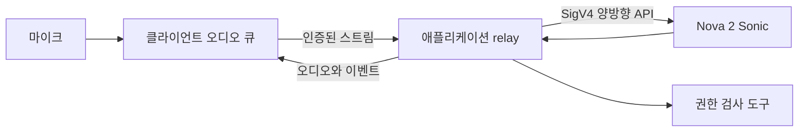

좋은 음성 에이전트는 텍스트 에이전트 앞뒤에 음성 인식과 합성을 붙인 제품이 아니다. 사용자는 에이전트가 말할 때 끼어들고, 도구가 실행되는 중에 마음을 바꾸며, 예측하기 어려운 지점에서 멈춘다. 대화가 끝나면 사적인 음성이 사라질 것이라고 기대하기도 한다. Amazon Nova 2 Sonic은 Amazon Bedrock의 양방향 스트리밍 API로 speech-to-speech 상호작용을 처리하지만 전송, 재생, 도구, 신원, 동의는 애플리케이션 책임이다.

## 브라우저와 Bedrock 사이에 신뢰할 수 있는 relay를 둔다

AWS 자격 증명을 브라우저나 모바일 앱에 넣지 않는다. 클라이언트에서 마이크 프레임을 수집하고 인증된 WebSocket 또는 WebRTC 연결로 백엔드에 보낸다. 백엔드는 SigV4 자격 증명으로 `InvokeModelWithBidirectionalStream`을 열고 구조화된 이벤트를 중계한다.



배포 리전에서 지원되는 모델 ID를 사용한다. AWS 시작 예제의 현재 값은 `amazon.nova-2-sonic-v1:0`이다. 모델 지원 범위는 바뀔 수 있으므로 여러 클라이언트에 하드코딩하지 말고 검증된 설정으로 관리한다.

API는 이벤트 기반이다. session과 prompt를 시작하고 system, user, assistant, tool, system-speech 콘텐츠마다 `contentStart`, 실제 content 이벤트, `contentEnd` 순서를 지킨다. protocol이 반환한 prompt, content, completion, session, tool-use ID를 정확히 유지한다. AWS의 full-featured sample에서 시작하는 편이 좋다. basic sample은 실제 양방향 처리와 barge-in을 의도적으로 생략한다.

## 끼어들기를 클라이언트 상태 전이로 다룬다

사용자가 끼어들면 Nova 2 Sonic은 음성 생성을 멈추고 interruption 알림을 보낸다. 클라이언트도 오디오 장치를 즉시 멈추고 중단된 completion에 속한 대기 오디오를 버려야 한다. 네트워크 스트림만 멈추면 버퍼에 있던 음성이 계속 재생되어 사용자를 무시하는 것처럼 들린다.

재생 데이터를 completion ID별로 관리한다. interruption이 오면 해당 ID를 무효화하고 늦게 도착한 chunk를 버리며 마이크 수집은 계속한다. UI도 ‘말하는 중’에서 ‘듣는 중’으로 바꾼다. 헤드폰과 스피커에서 모두 시험해야 한다. echo cancellation과 장치 지연, 브라우저 스케줄링이 결과에 영향을 준다.

## 비동기 도구에는 애플리케이션 제어가 필요하다

Nova 2 Sonic은 도구가 실행되는 동안에도 듣고 응답할 수 있다. 사용자가 요청을 바꿔도 앞선 도구가 자동 취소되지 않으며 결과는 모델에 전달된다. 따라서 도구의 수명 주기를 명시적으로 관리해야 한다.

```python
async def execute_tool(call, context):
    args = validate_schema(call.tool_name, call.content)
    authorize(context.principal, call.tool_name, args)
    result = await tools.run(
        call.tool_name, args,
        idempotency_key=call.tool_use_id,
        timeout_seconds=8,
    )
    return redact_and_bound(result)
```

모델의 도구 선택은 권한 부여가 아니다. 스키마, tenant, 리소스 소유권을 모델 밖에서 검사하고 timeout과 결과 크기 제한을 둔다. 중요한 동작에는 확인을 요구한다. 사용자가 의도를 바꾼 뒤 오래된 도구 결과가 돌아오면 요청 버전을 확인해 낡은 쓰기를 막아야 한다.

RAG는 읽기 전용 도구로 감싸고 출처가 있는 소수 문단만 반환한다. 검색된 글이 시스템 지시보다 높은 권한을 갖게 해서는 안 된다. 복잡한 흐름은 음성 도구의 timeout 뒤에 장기 에이전트를 숨기지 말고 내구성 있는 별도 서비스로 넘긴다.

## 개인정보 보호와 안전도 제품 동작이다

필요한 맥락에서 마이크 권한을 요청하고 녹음 상태를 분명히 표시한다. 음소거와 즉시 종료 버튼을 제공한다. 오디오, transcript, 도구 입력, 합성 응답을 저장할지 각각 정하고 제품 목적에 필요한 최소 보존을 기본값으로 삼는다. 일반 로그에는 민감 값을 가리고, 보존 자료는 암호화하며 삭제 절차를 문서화한다.

AI와 대화 중임을 알린다. 규제 대상이나 영향이 큰 동작은 이해한 요청을 다시 읽고 확인받는다. 확신이 낮거나 사용자가 원할 때 사람에게 연결한다. 억양, 언어, 언어 장애, 배경 소음, 유해 콘텐츠 대응을 대표성 있는 참여자와 평가한다.

## 연결 갱신과 측정

AWS 문서에는 연결 한도가 8분이며 갱신과 대화 연속성 패턴이 제공된다. 한도 전에 연결을 갱신하고 승인된 대화 컨텍스트만 이어 간다. 연속성을 보장할 수 없다면 재연결 상태를 사용자에게 보여준다.

마이크 입력부터 첫 음성까지의 지연, 끼어들기부터 실제 무음까지의 지연, 발화 종료 감지 오류, 재연결 성공률, 도구 지연, 작업 성공률과 사용자 정정을 측정한다. 원본 오디오는 기본적으로 저장하지 않고 이벤트 시각과 식별자를 기록한다. 동시 스트림을 부하 시험하고 사용자별 quota를 둔다.

## 이전 체크리스트

Nova Sonic v1 예제에서 Nova 2 문서와 모델 설정으로 이동한다. 임의의 WebSocket-to-model 구조 대신 공식 양방향 이벤트 순서를 구현한다. full-featured sample을 기반으로 completion-aware 버퍼 제거, 비동기 도구 상태, 권한 검사를 추가한다. 실제 장치에서 개인정보와 interruption 승인 테스트를 통과한 뒤 배포한다.

## 참고 자료

- [Nova 2 Sonic speech-to-speech 시작하기](https://docs.aws.amazon.com/nova/latest/nova2-userguide/sonic-getting-started.html)
- [Nova 2 Sonic 입력 이벤트](https://docs.aws.amazon.com/nova/latest/nova2-userguide/sonic-input-events.html)
- [Nova 2 Sonic 출력 이벤트와 barge-in](https://docs.aws.amazon.com/nova/latest/nova2-userguide/sonic-output-events.html)
- [Nova 2 Sonic 비동기 도구 호출](https://docs.aws.amazon.com/nova/latest/nova2-userguide/sonic-async-tools.html)
- [Nova 2 Sonic 코드 예제](https://docs.aws.amazon.com/nova/latest/nova2-userguide/sonic-code-examples.html)

_2026-08-01 기준 공식 문서를 확인했다._
